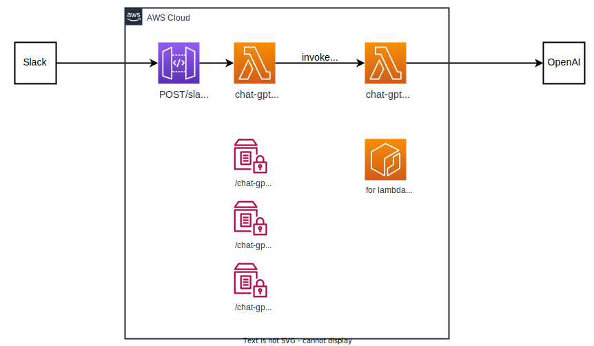

# ChatGPT Slack bot using LangChain
Sample application of ChatGPT Slack bot which uses LangChain.

This repo also contains terraform templates. You can setup AWS resources only executing just a few commands."

## Architecture


Lambda is provisioned by container mode because the size of LangChain is large and exceeds the limit of zip mode.

NOTE: To be more specific, although the gateway lambda is not using LangChain and could therefore be provisioned in zip mode, we have standardized on container mode in order to align the technologies being used.

## Sequence


## Install
Follow these 4 steps.

### Step 1: Create your slack app

Visit your Slack console and create new app with app manifest.

NOTE: `settings.event_subscriptions.request_url` is a place holder. You'll replace it by step 4.

```yaml
display_information:
  name: ChatGPTLangChain
features:
  bot_user:
    display_name: ChatGPTLangChain
    always_online: false
oauth_config:
  scopes:
    bot:
      - app_mentions:read
      - chat:write
      - channels:history
settings:
  event_subscriptions:
    request_url: https://xxxxxxxxxx.execute-api.ap-northeast-1.amazonaws.com/main/slack
    bot_events:
      - app_mention
  org_deploy_enabled: false
  socket_mode_enabled: false
  token_rotation_enabled: false
```

### Step 2: Register secrets to SSM Parameter Store

**Slack Bot User OAuth Token**

```sh
aws ssm put-parameter --name /chat-gpt-langchain-slack-bot/bot-user-token --value xoxb-XXXXXXXX --type SecureString
```

**Slack Signing Secret**

```sh
aws ssm put-parameter --name /chat-gpt-langchain-slack-bot/signing-secret --value XXXXXXXX --type SecureString
```

**OpenAI API Key**

```sh
aws ssm put-parameter --name /chat-gpt-langchain-slack-bot/open-ai-api-key --value XXXXXXXX --type SecureString
```

### Step 3: Setup AWS resources

```bash
cat << EOF > .env
ECR_AWS_ACCOUNT_ID=YOUR_AWS_ACCOUNT_HERE
ECR_AWS_REGION=ap-northeast-1
EOF

# Install the plugin to use .env file through poetry
poetry self add poetry-dotenv-plugin

make setup-all-resources
```

### Step 4: Replace event subscription url

Check your API Gateway id and set it by slack app console.

This command returns the api id of your API Gateway.

```bash
aws apigateway get-rest-apis --query 'items[?name==`chat-gpt-langchain-slack-bot`].id' --output text
```

```md
before: https://xxxxxxxxxx.execute-api.ap-northeast-1.amazonaws.com/main/slack
after: https://${YOUR_API_GATEWAY_ID}.execute-api.ap-northeast-1.amazonaws.com/main/slack
```

## For development
This repository is designed to have individual development settings for each lambda's Python code.
(If you use VSCode, please directly open each `src` directory. For example: `code ${path/to/repo}/src_gateway`)

Also, the following development tools are used:

- Linter: ruff
- Formatter: black
- Type hinting: mypy
- Dependency management: poetry

